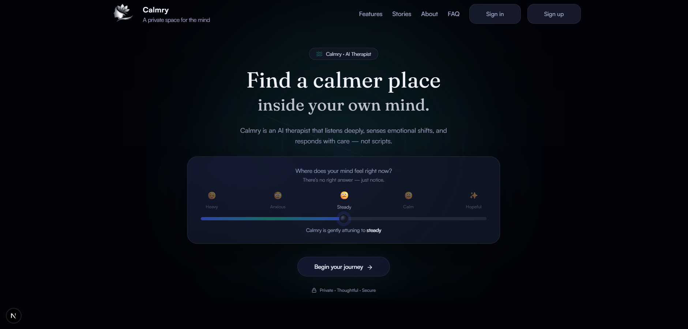
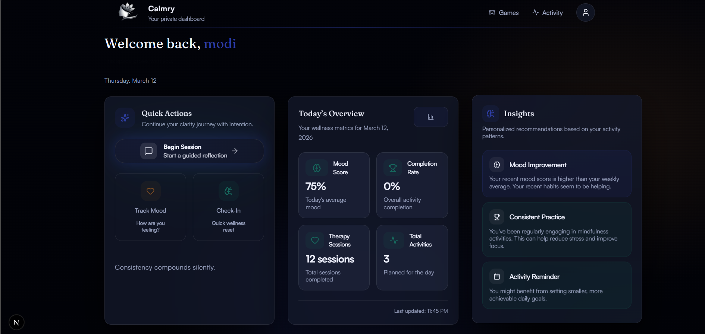
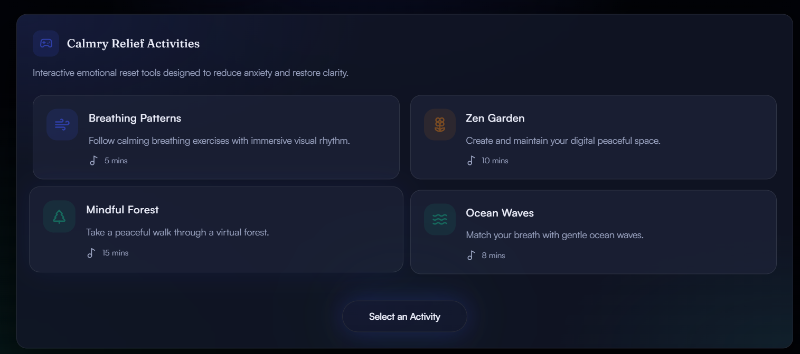

# Calmry — AI Therapist & Wellness Platform 🧠

Calmry is an AI-powered mental wellness platform designed to help users reflect, regulate emotions, and build healthier habits through guided conversations, mood tracking, and interactive mindfulness activities.

It combines AI therapy conversations, mood analytics, behavioral insights, and calming mini-games into a single experience that helps users understand their emotional patterns and build consistency in their mental wellness journey.

The project is built with a modern full-stack architecture, combining a responsive frontend dashboard with a secure backend API.

## 📸 Screenshots

### App

### Dashboard

### Games

## Repositories

### Frontend Repository
👉 https://github.com/krishnasahu22032003/Calmry/tree/main/frontend

### Backend Repository
👉 https://github.com/krishnasahu22032003/Calmry/tree/main/Backend

## Platform Overview

Calmry focuses on three key areas:

- Reflection – AI conversations that guide emotional exploration

- Tracking – Mood and activity tracking to understand patterns

- Regulation – Games and exercises that help reduce anxiety and stress

- The platform transforms everyday reflections into actionable insights that help users stay aware of their emotional health.

## 🚀 Key Features

### 🤖 AI Therapist Chat
- Guided conversations with an AI therapist
- Context-aware responses and emotional reflection
- Session history to revisit past conversations

### 📊 Mood Tracking
- Log mood using a slider
- Store mood score, notes, and timestamp
- Generates weekly emotional insights

### 🧘 Activity Tracking
- Track wellness activities like meditation, journaling, exercise, and reading
- Records duration, completion status, and timestamps
- Calculates completion rate and consistency

### 📈 Insight Engine
- AI analyzes mood and activity data
- Detects patterns like mood improvement, dips, and productivity trends
- Displays prioritized insights on the dashboard

### 🎮 Wellness Games
- Stress-relief mini games (e.g., Zen Garden, breathing exercises)
- Game sessions are logged as activities

### 🖥️ Dashboard Analytics
- View mood trends
- Track therapy sessions and activities
- Monitor completion rate and behavioral insights

## Architecture

The platform follows a separated frontend and backend architecture.

Frontend (Next.js)
        |
        | API Requests
        |
Backend (Node.js / Express)
        |
        | Database
        |
MongoDB

This separation allows independent scaling and deployment.

## 🛠️ Tech Stack

### 🎨 Frontend
- Next.js
- React
- TypeScript
- Tailwind CSS
- Framer Motion
- Axios
- Lucide Icons

### ⚙️ Backend
- Node.js
- Express.js
- MongoDB
- Mongoose
- JWT Authentication
- REST APIs

### 🤖 AI Integration
- OpenAI API (AI therapist conversations)

## ⚙️ Installation

### 📥 Clone the Repositories

**Frontend**

git clone https://github.com/YOUR_USERNAME/calmry-frontend.git

**Backend**

git clone https://github.com/YOUR_USERNAME/calmry-backend.git

### 🔧 Backend Setup

1. Navigate to backend folder

cd calmry-backend

2. Install dependencies

npm install

3. Create a `.env` file

PORT=5000
MONGO_URI=your_database_url
OPENAI_API_KEY=your_openai_key
JWT_SECRET=your_secret

4. Start the server

npm run dev

### 💻 Frontend Setup

1. Navigate to frontend folder

cd calmry-frontend

2. Install dependencies

npm install

3. Create `.env.local`

NEXT_PUBLIC_API_URL=http://localhost:5000

4. Start the development server

npm run dev

## Project Structure

### Frontend

- components/
- pages/
- lib/
- hooks/
- styles/

### Backend

- controllers/
- routes/
- models/
- middleware/
- utils/

## License

This project is licensed under the MIT License.

See the LICENSE file for details.

## Author

### Krishna Sahu
### Email: krishna.sahu.work@gmail.com